# ReDUCE: Redundant Detection of Downloads for Unified Control & Efficiency

> **Intelligent duplicate download detection and prevention system for browsers and file systems**

ReDUCE is a comprehensive solution that automatically detects and prevents redundant file downloads across your system, saving bandwidth, storage space, and time through intelligent metadata tracking and cross-platform file monitoring.

---

## 📋 Table of Contents

- [Overview](#overview)
- [System Architecture](#system-architecture)
- [Components](#components)
- [Features](#features)
- [Prerequisites](#prerequisites)
- [Quick Start](#quick-start)
- [How It Works](#how-it-works)
- [Configuration](#configuration)
- [API Reference](#api-reference)
- [Project Structure](#project-structure)
- [Troubleshooting](#troubleshooting)
- [Contributing](#contributing)

---

## Overview

### What is ReDUCE?

ReDUCE is an integrated system that prevents duplicate downloads by tracking file metadata across your browser and file system. It consists of three interconnected components:

- **Browser Extension** - Monitors and intercepts download requests
- **Metadata Server** - Centralized duplicate detection and record management
- **CLI Utility Tool** - File system monitoring and metadata synchronization

### The Problem

Users often download the same files multiple times, whether accidentally or unknowingly. This leads to:
- ❌ Wasted bandwidth
- ❌ Redundant storage consumption
- ❌ Cluttered download folders
- ❌ Time spent managing duplicate files

### The Solution

ReDUCE automatically:
- ✅ Detects duplicate downloads before they start
- ✅ Prevents redundant file transfers
- ✅ Tracks download metadata intelligently
- ✅ Synchronizes with file system changes
- ✅ Provides statistics on saved bandwidth and storage

---

## System Architecture

```mermaid
graph TB
    subgraph Browser["🌐 Browser Environment"]
        BE[Browser Extension]
    end
    
    subgraph Server["🖥️ Local Server"]
        MS[Metadata Server<br/>Flask API :5050]
        DB[(SQLite Database<br/>downloads.db)]
    end
    
    subgraph FileSystem["📁 File System"]
        FS[Monitored Files]
        CLI[CLI Utility Tool<br/>File Monitor]
    end
    
    BE -->|1. Download Request<br/>+ Metadata| MS
    MS -->|2. Check Duplicates| DB
    MS -->|3. Action Response<br/>Cancel/Proceed| BE
    MS -->|4. Store Record| DB
    CLI -->|5. Monitor Files| FS
    CLI -->|6. Sync Deletions| MS
    FS -.->|File Changes| CLI
    
    style BE fill:#4A90E2
    style MS fill:#50C878
    style DB fill:#FFB347
    style CLI fill:#9B59B6
    style FS fill:#E8E8E8
```



### Data Flow

1. **Download Initiation**: User starts a download in the browser
2. **Metadata Extraction**: Extension extracts file metadata (URL, size, content type, hash)
3. **Duplicate Check**: Server queries database for matching files
4. **Decision**: Server responds with action (cancel if duplicate, proceed if new)
5. **File Monitoring**: CLI tool watches file system for changes
6. **Synchronization**: Deleted files trigger database cleanup

---

## Components

### 🧩 Browser Extension
**Location**: `reduce-New-Extension/`

A Chromium-based browser extension (Manifest V3) that:
- Monitors download events in real-time
- Extracts comprehensive metadata before downloads start
- Communicates with the Metadata Server via REST API
- Cancels duplicate downloads automatically
- Provides a popup interface for viewing download history

**Technologies**: JavaScript (ES6 Modules), Chrome Extensions API, Service Workers

📖 **[Detailed Documentation →](reduce-New-Extension/README.md)**

---

### 🛠️ Metadata Server
**Location**: `reduce-Internal-Metadata-Server/`

A Flask-based REST API server that:
- Manages SQLite database of download records
- Implements duplicate detection algorithms
- Provides RESTful endpoints for download management
- Tracks statistics (bandwidth saved, duplicates prevented)
- Handles device-specific download records

**Technologies**: Python 3, Flask, SQLite

📖 **[Detailed Documentation →](reduce-Internal-Metadata-Server/README.md)**

---

### 💻 CLI Utility Tools
**Location**: `reduce-CLI-Utility-Tool/`

Two command-line utilities for file system monitoring and download management:

#### File Monitoring Service
Cross-platform file system monitoring that:
- Monitors files with ReDUCE metadata
- Uses platform-specific metadata storage (ADS on Windows, xattr on Linux/macOS)
- Automatically syncs file deletions with the server
- Collects device information for tracking
- Runs as background service

#### CLI Download Wrapper  
Command-line interface for download commands:
- Wraps `wget` and `curl` commands
- Executes Python and Bash download scripts
- Automatic metadata extraction
- Server communication for duplicate checking

**Technologies**: Python 3, Watchdog, pyxattr (Linux/macOS)

📖 **[Detailed Documentation →](reduce-CLI-Utility-Tool/README.md)**

---

## Features

### ✨ Core Features

- **🔍 Intelligent Duplicate Detection**
  - Hash-based file identification
  - Metadata comparison (filename, size, URL, content-type)
  - Per-device tracking

- **🌍 Cross-Platform Support**
  - Windows (Alternate Data Streams)
  - Linux (Extended Attributes)
  - macOS (Extended Attributes)

- **⚡ Real-Time Monitoring**
  - File system event tracking
  - Instant download interception
  - Automatic database synchronization

- **📊 Statistics & Insights**
  - Bandwidth saved tracker
  - Storage optimization metrics
  - Download history analytics

- **🔌 Extensible Architecture**
  - RESTful API for integrations
  - Modular component design
  - Clear separation of concerns

---

## Prerequisites

### For Browser Extension
- Chrome, Edge, Brave, or any Chromium-based browser
- Developer mode enabled (for manual installation)

### For Metadata Server
- **Python**: 3.7 or higher
- **pip**: Python package manager
- **Dependencies**:
  - Flask
  - (See `reduce-Internal-Metadata-Server/requirements.txt`)

### For CLI Utility Tool
- **Python**: 3.7 or higher
- **pip**: Python package manager
- **Dependencies**:
  - requests
  - watchdog
  - pyxattr (Linux/macOS only)
  - pyinstaller (for building standalone executables)

---

## Quick Start

### Step 1️⃣: Set Up the Metadata Server

```bash
# Navigate to server directory
cd reduce-Internal-Metadata-Server

# Install dependencies
pip install -r requirements.txt

# Start the server (runs on port 5050)
python main.py
```

The server will start at `http://127.0.0.1:5050` and initialize the SQLite database.

---

### Step 2️⃣: Set Up the File Monitoring Service

```bash
# Navigate to file monitoring service
cd reduce-CLI-Utility-Tool/file-monitoring-service

# Install dependencies
pip install -r requirements.txt

# Run the file monitor
python file_monitor.py
```

The file monitoring service will:
- Initialize cache from existing files with metadata
- Start monitoring the file system (C:\ on Windows, ~/ on Linux/macOS)
- Begin syncing with the Metadata Server

---

### Step 3️⃣: Install Browser Extension

1. Open your Chromium-based browser
2. Navigate to `chrome://extensions/` (or `edge://extensions/` for Edge)
3. Enable **Developer mode** (toggle in top-right corner)
4. Click **"Load unpacked"**
5. Select the `reduce-New-Extension` folder
6. The extension icon should appear in your toolbar

---

### Step 4️⃣: Test the System

1. Try downloading a file from the internet
2. The download should proceed normally
3. Try downloading the **same file again**
4. The extension should detect the duplicate and cancel the download
5. Check the extension popup to view download history

---

## How It Works

### Complete Workflow


### Key Mechanisms

1. **Metadata Hashing**: Files are identified using SHA-1 hash of (filename + content-length)
2. **Partial Hash Verification**: Additional hash stored in file metadata for verification
3. **Device Tracking**: Downloads are tracked per device using MAC address and device ID
4. **Platform-Specific Metadata**:
   - **Windows**: Alternate Data Streams (`:file_hash_check_parts`)
   - **Linux/macOS**: Extended Attributes (`user.file_hash_check_parts`)

---

## Configuration

### Metadata Server Configuration

**File**: `reduce-Internal-Metadata-Server/main.py`

```python
# Default configuration
PORT = 5050
DATABASE = 'downloads.db'
DEBUG_MODE = True
```

**Change Port**:
```python
if __name__ == '__main__':
    app.run(port=5050, debug=True)  # Change port here
```

---

### File Monitoring Service Configuration

**File**: `reduce-CLI-Utility-Tool/file-monitoring-service/file_monitor.py`

```python
# Default monitored paths
# Windows: C:\
# Linux/macOS: ~/

# Server endpoint
SERVER_URL = "http://127.0.0.1:5050"
```

**Change Monitored Path** (Lines 312-315):
```python
if is_windows():
    path_to_monitor = "C:\\"  # Change for Windows
else:
    path_to_monitor = os.path.expanduser("~")  # Change for Linux/macOS
```

---

### Browser Extension Configuration

**File**: `reduce-New-Extension/utils/config.js` (if exists) or modify in code

The extension connects to `http://127.0.0.1:5050` by default.

---

## API Reference

### Quick Reference

| Endpoint | Method | Description |
|----------|--------|-------------|
| `/process_download` | POST | Process new download request and check for duplicates |
| `/delete_record` | POST | Delete download record by partial hash |
| `/get_all_downloads` | GET | Retrieve all download records |
| `/cancelled_download_stats` | GET | Get statistics on cancelled downloads |
| `/completed_download_stats` | GET | Get statistics on completed downloads |
| `/device_info` | GET | Get current device information |

### Example: Process Download

**Request**:
```bash
POST http://127.0.0.1:5050/process_download
Content-Type: application/json

{
  "id": "download-id",
  "data": {
    "download_meta_data": {
      "url": "https://example.com/file.zip",
      "finalUrl": "https://cdn.example.com/file.zip",
      "referrer": "https://example.com"
    },
    "fetched_complete_metadata": {
      "content-length": "1048576",
      "content-type": "application/zip",
      "etag": "abc123"
    },
    "downloadFileNameDomainUrlDetails": {
      "downloadFileName": "file.zip",
      "domain": "cdn.example.com"
    },
    "partial_hash": "abc123def456",
    "device_info": {
      "device_id": "device-uuid",
      "device_name": "laptop",
      "current_user": "user",
      "mac_address": "00:11:22:33:44:55"
    }
  }
}
```

**Response**:
```json
{
  "action": 0  // 0 = proceed, 1 = cancel
}
```

📖 **[Full API Documentation →](reduce-Internal-Metadata-Server/README.md#api-endpoints)**

---

## Project Structure

```
ReDUCE/
├── README.md                           # This file
├── .gitignore
│
├── reduce-New-Extension/               # Browser Extension
│   ├── manifest.json                   # Extension manifest (V3)
│   ├── background/
│   │   ├── index.js                    # Service worker entry
│   │   └── observer.js                 # Download event observer
│   ├── content/
│   │   └── content.js                  # Content scripts
│   ├── pages/
│   │   └── popup.html                  # Extension popup UI
│   ├── utils/                          # Utility functions
│   └── icons/                          # Extension icons
│
├── reduce-Internal-Metadata-Server/    # Flask API Server
│   ├── main.py                         # Flask application & routes
│   ├── model.py                        # Database models & queries
│   ├── a.py                            # Additional utilities
│   ├── requirements.txt                # Python dependencies
│   ├── downloads.db                    # SQLite database (created at runtime)
│   └── README.md                       # Server documentation
│
└── reduce-CLI-Utility-Tool/            # CLI Utilities
    ├── README.md                       # Overview of both tools
    ├── file-monitoring-service/        # File system monitor
    │   ├── file_monitor.py             # Main monitoring script
    │   ├── metadata_checker.py         # Metadata utility
    │   ├── requirements.txt            # Dependencies
    │   └── README.md                   # Monitoring docs
    └── cli-download-wrapper/           # Download command wrapper
        ├── reduce.py                   # CLI entry point
        ├── handlers/                   # Command handlers
        ├── download_logic/             # Processing logic
        ├── utils/                      # Utilities
        ├── requirements.txt            # Dependencies
        └── README.md                   # CLI wrapper docs
```

---

## Troubleshooting

### Common Issues

#### ❌ Server Not Responding

**Symptom**: Extension can't connect to server, CLI tool shows connection errors

**Solutions**:
1. Verify server is running: `python main.py` in the server directory
2. Check the server is listening on port 5050
3. Ensure no firewall is blocking port 5050
4. Check server logs for errors

---

#### ❌ Extension Not Working

**Symptom**: Downloads aren't being intercepted

**Solutions**:
1. Verify extension is installed and enabled in `chrome://extensions/`
2. Check extension popup shows no errors
3. Reload the extension (click reload button in extensions page)
4. Check browser console for errors (F12 → Console)
5. Ensure server is running and accessible

---

#### ❌ CLI Tool Errors on Linux/macOS

**Symptom**: `ModuleNotFoundError: No module named 'xattr'`

**Solution**:
```bash
pip install pyxattr
```

---

#### ❌ Permission Errors (CLI Tool)

**Symptom**: Access denied when monitoring certain directories

**Solutions**:
- **Windows**: Run as Administrator
- **Linux/macOS**: Use `sudo` or adjust monitored path to user directory

---

#### ❌ Database Locked Error

**Symptom**: `sqlite3.OperationalError: database is locked`

**Solutions**:
1. Ensure only one instance of the server is running
2. Close any database browser tools that might have the DB open
3. Restart the server

---

#### ❌ Downloads Still Proceeding Despite Duplicates

**Symptom**: Duplicate downloads aren't being cancelled

**Solutions**:
1. Check server logs to see if the download was detected as a duplicate
2. Verify the original file still has metadata attached
3. Check if the file hash matches (device-specific tracking)
4. Ensure the extension has permission to cancel downloads

---

## Contributing

We welcome contributions! Here's how you can help:

### Reporting Issues
- Use the GitHub Issues tab
- Provide detailed error messages and logs
- Include your OS and Python/browser versions
- Describe steps to reproduce the issue

### Submitting Pull Requests
1. Fork the repository
2. Create a feature branch (`git checkout -b feature/amazing-feature`)
3. Make your changes
4. Test thoroughly across platforms
5. Commit with clear messages (`git commit -m 'Add amazing feature'`)
6. Push to your fork (`git push origin feature/amazing-feature`)
7. Open a Pull Request

### Code Style
- **Python**: Follow PEP 8 guidelines
- **JavaScript**: Use ES6+ features, consistent naming
- Add comments for complex logic
- Update documentation for new features

---

## License

*License information to be determined*

---

## Authors & Credits

**Project Maintainers**: ReDUCE Development Team

**Contributors**: See contributor list on GitHub

---

## Support

For questions, issues, or feature requests, please:
- 📧 Open an issue on GitHub
- 📖 Check component-specific README files
- 💬 Review troubleshooting section

---

<div align="center">

**Built with ❤️ for efficient download management**

*ReDUCE: Because you shouldn't download the same file twice*

</div>
