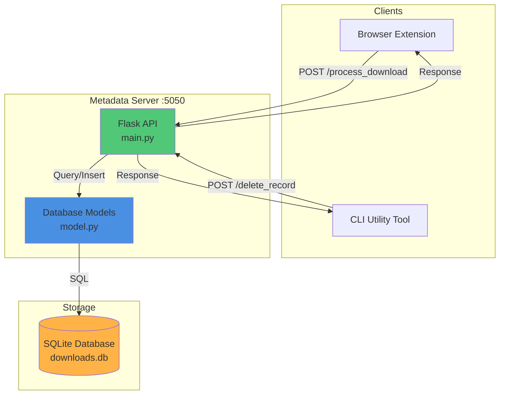
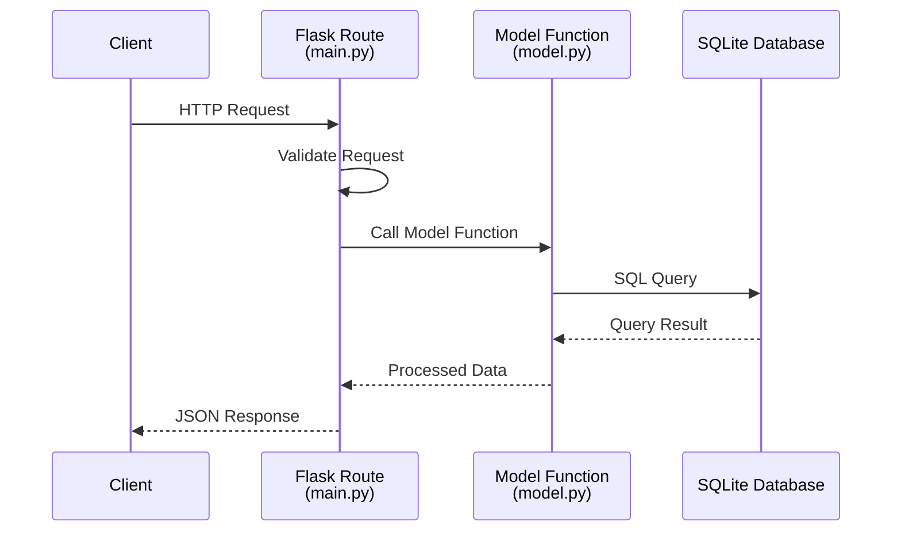
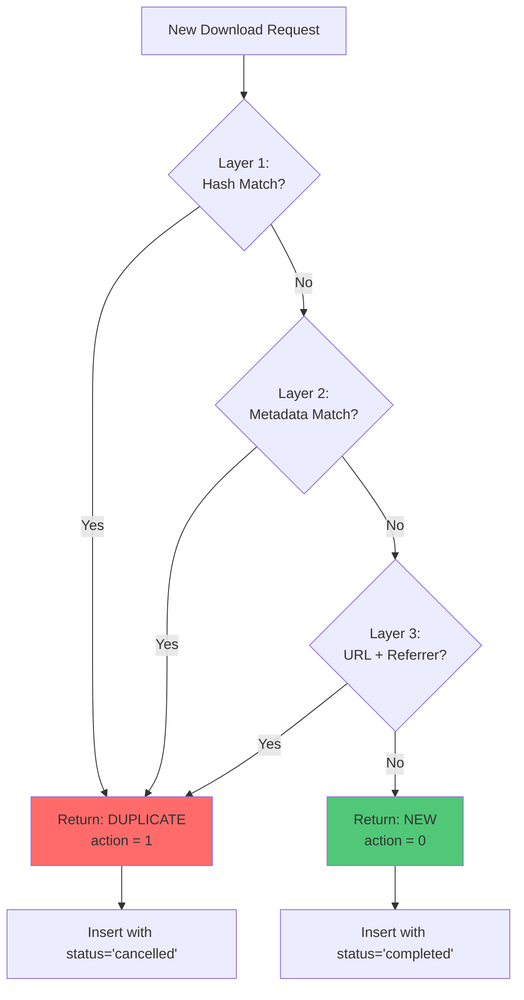
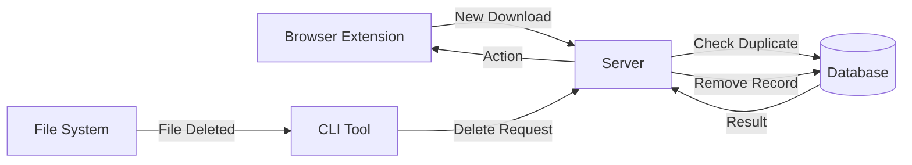

# ReDUCE Metadata Server

> **Flask-based REST API for intelligent duplicate download detection and record management**

The Metadata Server is the central intelligence of the ReDUCE system, providing a RESTful API for duplicate detection, download tracking, and statistics reporting through an SQLite database backend.

---

## 📋 Table of Contents

- [Overview](#overview)
- [Features](#features)
- [Architecture](#architecture)
- [Prerequisites](#prerequisites)
- [Installation](#installation)
- [Database Schema](#database-schema)
- [API Endpoints](#api-endpoints)
- [Configuration](#configuration)
- [Usage](#usage)
- [Duplicate Detection Logic](#duplicate-detection-logic)
- [Model Functions](#model-functions)
- [Database Management](#database-management)
- [Troubleshooting](#troubleshooting)
- [API Usage Examples](#api-usage-examples)
- [Development](#development)
- [Performance](#performance)

---

## Overview

### What is the Metadata Server?

The Metadata Server is a Flask-based REST API that serves as the **central intelligence** of the ReDUCE system. It:
- **Processes** download requests from the browser extension
- **Detects** duplicate downloads using multi-layer matching algorithms
- **Stores** download metadata in an SQLite database
- **Synchronizes** with the CLI tool for file deletion events
- **Provides** statistics on bandwidth and storage savings

### Role in ReDUCE System



The server acts as the single source of truth for all download records across devices.

---

## Features

### ✨ Core Capabilities

- **🔌 RESTful API**
  - Flask-based web service
  - JSON request/response format
  - 6 documented endpoints

- **💾 SQLite Database**
  - Automatic schema creation
  - Indexed queries for performance
  - Persistent storage

- **🔍 Intelligent Duplicate Detection**
  - Multi-layer matching algorithm
  - Hash-based identification (`id_hash_verify`)
  - Metadata comparison (filename, size, etag, last-modified)
  - URL and referrer matching

- **📊 Device-Specific Tracking**
  - Per-device download records
  - Device fingerprinting (ID, name, MAC address)
  - User-specific tracking

- **📈 Statistics & Analytics**
  - Bandwidth saved calculations
  - Download completion/cancellation counts
  - Total content length metrics

- **🚀 Auto-Initialization**
  - Database created on first run
  - Schema migrations handled automatically
  - No manual setup required

---

## Architecture

### System Components

```
reduce-Internal-Metadata-Server/
├── main.py              # Flask application & routes
├── model.py             # Database models & queries
├── a.py                 # Additional utilities
├── requirements.txt     # Python dependencies
├── downloads.db         # SQLite database (created at runtime)
└── README.md           # This file
```

---

### Request Flow



---

## Prerequisites

### System Requirements

- **Python**: 3.7 or higher
- **pip**: Python package manager
- **Operating System**: Windows, Linux, or macOS

### Dependencies

From `requirements.txt`:
- **Flask**: Web framework
- **sqlite3**: Database (built into Python)
- Additional utilities as specified

---

## Installation

### Step 1: Navigate to Server Directory

```bash
cd reduce-Internal-Metadata-Server
```

### Step 2: Install Dependencies

```bash
pip install -r requirements.txt
```

### Step 3: Verify Installation

```bash
python main.py
```

**Expected Output**:
```
creating db
Database initialized successfully.
 * Serving Flask app 'main'
 * Debug mode: on
 * Running on http://127.0.0.1:5050
```

The server will automatically create `downloads.db` on first run.

---

## Database Schema

### `downloads` Table

The database stores all download records with the following schema:

| Column | Type | Description | Constraints |
|--------|------|-------------|-------------|
| `uuid` | TEXT | Unique record identifier | PRIMARY KEY |
| `id_hash_verify` | TEXT | SHA-1 hash of (filename + content-length) | UNIQUE |
| `url` | TEXT | Original download URL | NOT NULL |
| `referrer` | TEXT | Referring page URL | |
| `finalUrl` | TEXT | Final redirect URL | |
| `normalized_path` | TEXT | Normalized URL path | |
| `filename` | TEXT | Download filename | |
| `download_server_domain` | TEXT | Server domain | |
| `content_length` | INTEGER | File size in bytes | |
| `content_type` | TEXT | MIME type | |
| `last_modified` | TEXT | Last-Modified header | |
| `etag` | TEXT | ETag header | |
| `content_disposition` | TEXT | Content-Disposition header | |
| `current_user` | TEXT | User who downloaded | |
| `device_id` | TEXT | Unique device identifier | |
| `device_name` | TEXT | Device hostname | |
| `mac_address` | TEXT | Device MAC address | |
| `partial_hash_verify` | TEXT | File metadata hash | |
| `status` | TEXT | 'completed' or 'cancelled' | |
| `inserted_at` | TIMESTAMP | Record creation time | DEFAULT CURRENT_TIMESTAMP |

---

### Database Indexes

For optimal query performance, the following indexes are created:

```sql
CREATE INDEX idx_normalized_path ON downloads (normalized_path);
CREATE INDEX idx_filename ON downloads (filename);
CREATE INDEX idx_id_hash_verify ON downloads (id_hash_verify);
CREATE INDEX idx_content_length ON downloads (content_length);
CREATE INDEX idx_last_modified ON downloads (last_modified);
CREATE INDEX idx_etag ON downloads (etag);
CREATE INDEX idx_partial_hash_verify ON downloads (partial_hash_verify);
```

---

## API Endpoints

### Quick Reference

| Endpoint | Method | Purpose |
|----------|--------|---------|
| [`/device_info`](#get-device_info) | GET | Get current device information |
| [`/process_download`](#post-process_download) | POST | Process download and check for duplicates |
| [`/delete_record`](#post-delete_record) | POST | Delete record by partial hash |
| [`/get_all_downloads`](#get-get_all_downloads) | GET | Retrieve all download records |
| [`/cancelled_download_stats`](#get-cancelled_download_stats) | GET | Get cancelled download statistics |
| [`/completed_download_stats`](#get-completed_download_stats) | GET | Get completed download statistics |

---

### GET `/device_info`

**Purpose**: Retrieve device information for the current machine

**Request**: None required

**Response**:
```json
{
  "device_id": "12345-abcde-67890",
  "device_name": "LAPTOP-ABC123",
  "current_user": "username",
  "mac_address": "00:11:22:33:44:55"
}
```

**Example**:
```bash
curl http://127.0.0.1:5050/device_info
```

---

### POST `/process_download`

**Purpose**: Process new download request and check for duplicates

**Request Headers**:
```
Content-Type: application/json
```

**Request Body**:
```json
{
  "id": "download-123",
  "data": {
    "download_meta_data": {
      "url": "https://example.com/file.zip",
      "finalUrl": "https://cdn.example.com/file.zip",
      "referrer": "https://example.com/downloads"
    },
    "fetched_complete_metadata": {
      "content-length": "1048576",
      "content-type": "application/zip",
      "etag": "abc123def456",
      "last-modified": "Wed, 21 Oct 2024 07:28:00 GMT",
      "content-disposition": "attachment; filename=\"file.zip\""
    },
    "downloadFileNameDomainUrlDetails": {
      "downloadFileName": "file.zip",
      "domain": "cdn.example.com"
    },
    "partial_hash": "xyz789abc123",
    "device_info": {
      "device_id": "device-uuid",
      "device_name": "LAPTOP",
      "current_user": "user",
      "mac_address": "AA:BB:CC:DD:EE:FF"
    }
  }
}
```

**Response**:
```json
{
  "action": 0
}
```

**Action Values**:
- `0` - **Proceed** with download (not a duplicate)
- `1` - **Cancel** download (duplicate detected)

**Status Codes**:
- `200` - Success
- `400` - Invalid request (missing required fields)
- `500` - Server error

**Example**:
```bash
curl -X POST http://127.0.0.1:5050/process_download \
  -H "Content-Type: application/json" \
  -d @request.json
```

---

### POST `/delete_record`

**Purpose**: Delete download record when file is removed from file system

**Request Body**:
```json
{
  "partial_hash_verify": "xyz789abc123",
  "device_info": {
    "device_id": "device-uuid",
    "device_name": "LAPTOP",
    "current_user": "user",
    "mac_address": "AA:BB:CC:DD:EE:FF"
  }
}
```

**Success Response** (200):
```json
{
  "status": "success",
  "message": "Record with partial_hash_verify xyz789abc123 deleted."
}
```

**Not Found Response** (404):
```json
{
  "status": "not_found",
  "message": "No record found for partial_hash_verify xyz789abc123"
}
```

**Status Codes**:
- `200` - Successfully deleted
- `404` - Record not found
- `400` - Missing `partial_hash_verify`

**Example**:
```bash
curl -X POST http://127.0.0.1:5050/delete_record \
  -H "Content-Type: application/json" \
  -d '{"partial_hash_verify":"xyz789abc123","device_info":{...}}'
```

---

### GET `/get_all_downloads`

**Purpose**: Retrieve all download records from the database

**Request**: None required

**Response**:
```json
[
  {
    "uuid": "a1b2c3d4-e5f6-7890-1234-567890abcdef",
    "id_hash_verify": "abc123def456",
    "filename": "file.zip",
    "content_length": 1048576,
    "status": "completed",
    "inserted_at": "2025-12-03 12:00:00",
    "device_name": "LAPTOP",
    ...
  },
  {
    "uuid": "f6e5d4c3-b2a1-0987-6543-210fedcba987",
    "filename": "document.pdf",
    "content_length": 524288,
    "status": "cancelled",
    ...
  }
]
```

**Example**:
```bash
curl http://127.0.0.1:5050/get_all_downloads
```

---

### GET `/cancelled_download_stats`

**Purpose**: Get statistics on cancelled (duplicate) downloads

**Response**:
```json
{
  "cancelled_count": 15,
  "cancelled_total_content_length": 157286400
}
```

**Fields**:
- `cancelled_count`: Number of downloads cancelled due to duplicates
- `cancelled_total_content_length`: Total bytes saved by preventing duplicates

**Example**:
```bash
curl http://127.0.0.1:5050/cancelled_download_stats
```

**Interpretation**:
```
15 duplicate downloads prevented
~150 MB bandwidth saved
```

---

### GET `/completed_download_stats`

**Purpose**: Get statistics on completed downloads

**Response**:
```json
{
  "completed_count": 42,
  "completed_total_content_length": 536870912
}
```

**Fields**:
- `completed_count`: Number of unique downloads completed
- `completed_total_content_length`: Total bytes downloaded

**Example**:
```bash
curl http://127.0.0.1:5050/completed_download_stats
```

---

## Configuration

### Default Settings

**File**: `main.py` (Lines 266-267)

```python
if __name__ == '__main__':
    app.run(port=5050, debug=True)
```

| Setting | Default Value | Description |
|---------|---------------|-------------|
| **Port** | `5050` | HTTP server port |
| **Host** | `127.0.0.1` (localhost) | Server bind address |
| **Debug Mode** | `True` | Auto-reload and debug output |
| **Database** | `downloads.db` | SQLite database file |

---

### Changing the Port

Edit `main.py`:

```python
if __name__ == '__main__':
    app.run(port=8080, debug=True)  # Change to port 8080
```

**Note**: Update Browser Extension and CLI Tool configurations to match.

---

### Production Configuration

For production deployment:

```python
if __name__ == '__main__':
    app.run(
        host='0.0.0.0',  # Listen on all interfaces
        port=5050,
        debug=False      # Disable debug mode
    )
```

**Recommended**: Use a production WSGI server like **gunicorn** or **waitress**:

```bash
# Install gunicorn
pip install gunicorn

# Run with gunicorn
gunicorn -w 4 -b 0.0.0.0:5050 main:app
```

---

## Usage

### Starting the Server

```bash
python main.py
```

### Expected Console Output

```
creating db
Database initialized successfully.
 * Serving Flask app 'main'
 * Debug mode: on
WARNING: This is a development server. Do not use it in production.
 * Running on http://127.0.0.1:5050
Press CTRL+C to quit
 * Restarting with stat
 * Debugger is active!
```

---

### Testing Endpoints

#### Using curl

**Get Device Info**:
```bash
curl http://127.0.0.1:5050/device_info
```

**Get All Downloads**:
```bash
curl http://127.0.0.1:5050/get_all_downloads | python -m json.tool
```

**Get Statistics**:
```bash
curl http://127.0.0.1:5050/cancelled_download_stats
curl http://127.0.0.1:5050/completed_download_stats
```

---

#### Using Python

```python
import requests

# Get device info
response = requests.get('http://127.0.0.1:5050/device_info')
print(response.json())

# Get all downloads
response = requests.get('http://127.0.0.1:5050/get_all_downloads')
downloads = response.json()
print(f"Total downloads: {len(downloads)}")

# Get statistics
stats = requests.get('http://127.0.0.1:5050/cancelled_download_stats').json()
print(f"Duplicates prevented: {stats['cancelled_count']}")
print(f"Bandwidth saved: {stats['cancelled_total_content_length'] / 1024 / 1024:.2f} MB")
```

---

## Duplicate Detection Logic

The server implements a **three-layer duplicate detection algorithm**:

### Layer 1: Hash-Based Matching

**Algorithm**:
```python
id_hash_verify_input = filename + str(content_length)
id_hash_verify = hashlib.sha1(input.encode()).hexdigest()
```

**Matching**: Exact match on `id_hash_verify`

**Advantages**:
- ✅ Fast (indexed column)
- ✅ Reliable for identical files

---

### Layer 2: Metadata Matching

**Matching Criteria** (ALL must match):
1. `filename` - Exact filename match
2. `content_length` - Exact file size
3. `last_modified` - Last-Modified header (optional)
4. `etag` - ETag header (optional)

**Query**:
```sql
SELECT * FROM downloads 
WHERE filename = ? 
  AND content_length = ?
  AND last_modified = ? 
  AND etag = ?
```

---

### Layer 3: URL & Referrer Matching

**Matching Criteria**:
- `url` - Exact URL match
- `referrer` - Exact referrer match

**Use Case**: Same download link accessed from same page

---

### Decision Flow



---

## Model Functions

### Core Database Functions

#### `initialize_db()`

**Purpose**: Create database schema and indexes

**Behavior**:
- Creates `downloads` table if it doesn't exist
- Creates 7 indexes for query optimization
- Handles schema migrations (adds `status` column if missing)

**Called**: Automatically when `main.py` starts

---

#### `insert_download(download_data)`

**Purpose**: Insert new download record

**Parameters**:
```python
{
    'id_hash_verify': 'abc123...',
    'url': '...',
    'filename': '...',
    'content-length': 1048576,
    'status': 'completed' or 'cancelled',
    ...
}
```

**Behavior**:
- Generates UUID for record
- Inserts with current timestamp
- Handles duplicate `id_hash_verify` gracefully

---

#### `is_duplicate_download(current_download)`

**Purpose**: Check if download is a duplicate

**Returns**:
- `0` - Duplicate found
- `1` - Not a duplicate

**Algorithm**: Three-layer matching (see [Duplicate Detection Logic](#duplicate-detection-logic))

---

#### `delete_record_by_partial_hash(partial_hash)`

**Purpose**: Delete record by `partial_hash_verify`

**Returns**:
- `True` - Record deleted
- `False` - No record found

**Use Case**: Called by CLI tool when file is deleted

---

#### `get_normalized_path(url)`

**Purpose**: Extract normalized path from URL

**Example**:
```python
get_normalized_path("https://example.com/path/file.zip?v=1")
# Returns: "/path/file.zip"
```

---

#### `extract_filename(download)`

**Purpose**: Extract filename from metadata

**Priority**:
1. `content-disposition` header → `filename=...`
2. `finalUrl` → last path segment
3. `url` → last path segment

**Example**:
```python
extract_filename({
    'content_disposition': 'attachment; filename="document.pdf"'
})
# Returns: "document.pdf"
```

---

## Database Management

### Viewing Database Contents

#### Using SQLite Command-Line

```bash
# Open database
sqlite3 downloads.db

# View schema
.schema downloads

# Query all records
SELECT * FROM downloads;

# Count downloads by status
SELECT status, COUNT(*) FROM downloads GROUP BY status;

# View recent downloads
SELECT filename, status, inserted_at 
FROM downloads 
ORDER BY inserted_at DESC 
LIMIT 10;

# Exit
.quit
```

---

#### Using Python

```python
import sqlite3

conn = sqlite3.connect('downloads.db')
cursor = conn.cursor()

# Get all completed downloads
cursor.execute("SELECT filename, content_length FROM downloads WHERE status='completed'")
for row in cursor.fetchall():
    print(f"{row[0]}: {row[1] / 1024 / 1024:.2f} MB")

conn.close()
```

---

### Backing Up Database

```bash
# Simple file copy
cp downloads.db downloads_backup_$(date +%Y%m%d).db

# SQLite dump (SQL format)
sqlite3 downloads.db .dump > backup.sql

# Restore from dump
sqlite3 new_downloads.db < backup.sql
```

---

### Resetting Database

```bash
# Stop the server (CTRL+C)

# Delete database file
rm downloads.db

# Restart server - database will be recreated
python main.py
```

---

### Database Maintenance

```sql
-- Vacuum database (reclaim space)
VACUUM;

-- Analyze for query optimization
ANALYZE;

-- Check integrity
PRAGMA integrity_check;
```

---

## Troubleshooting

### Common Issues

#### ❌ Port Already in Use

**Error**:
```
OSError: [Errno 48] Address already in use
```

**Solution**:

**Windows**:
```powershell
# Find process using port 5050
netstat -ano | findstr :5050

# Kill process
taskkill /PID <PID> /F
```

**Linux/macOS**:
```bash
# Find process
lsof -i :5050

# Kill process
kill -9 <PID>

# Or use different port
python main.py  # Edit main.py first
```

---

#### ❌ Database Locked

**Error**:
```
sqlite3.OperationalError: database is locked
```

**Causes**:
- Multiple server instances running
- Database browser tool has DB open
- Concurrent write operations

**Solutions**:
1. Stop all server instances
2. Close DB browser tools (DB Browser for SQLite, etc.)
3. Restart server

---

#### ❌ Missing Dependencies

**Error**:
```
ModuleNotFoundError: No module named 'flask'
```

**Solution**:
```bash
pip install -r requirements.txt
```

---

#### ❌ Import Errors (model.py)

**Error**:
```
ModuleNotFoundError: No module named 'model'
```

**Solutions**:
1. Verify `model.py` exists in same directory as `main.py`
2. Run from correct directory:
   ```bash
   cd reduce-Internal-Metadata-Server
   python main.py
   ```

---

#### ❌ Database Schema Mismatch

**Symptom**: Missing columns or errors on insert

**Solution**:
```bash
# Delete old database
rm downloads.db

# Restart server to recreate with latest schema
python main.py
```

---

## API Usage Examples

### Python Client

```python
import requests
import json

BASE_URL = "http://127.0.0.1:5050"

# Process download
def process_download(download_data):
    response = requests.post(
        f"{BASE_URL}/process_download",
        json={"id": "download-123", "data": download_data}
    )
    result = response.json()
    
    if result['action'] == 1:
        print("❌ Duplicate detected - download cancelled")
    else:
        print("✅ New download - proceeding")
    
    return result

# Delete record
def delete_record(partial_hash):
    response = requests.post(
        f"{BASE_URL}/delete_record",
        json={
            "partial_hash_verify": partial_hash,
            "device_info": {...}
        }
    )
    return response.json()

# Get statistics
def get_statistics():
    stats = requests.get(f"{BASE_URL}/cancelled_download_stats").json()
    completed = requests.get(f"{BASE_URL}/completed_download_stats").json()
    
    print(f"Completed: {completed['completed_count']}")
    print(f"Cancelled: {stats['cancelled_count']}")
    print(f"Bandwidth saved: {stats['cancelled_total_content_length'] / 1024 / 1024:.2f} MB")
```

---

### JavaScript Client

```javascript
const BASE_URL = 'http://127.0.0.1:5050';

// Process download
async function processDownload(downloadData) {
  const response = await fetch(`${BASE_URL}/process_download`, {
    method: 'POST',
    headers: { 'Content-Type': 'application/json' },
    body: JSON.stringify({ id: 'download-123', data: downloadData })
  });
  
  const result = await response.json();
  
  if (result.action === 1) {
    console.log('❌ Duplicate detected');
  } else {
    console.log('✅ New download');
  }
  
  return result;
}

// Get all downloads
async function getAllDownloads() {
  const response = await fetch(`${BASE_URL}/get_all_downloads`);
  const downloads = await response.json();
  console.log(`Total downloads: ${downloads.length}`);
  return downloads;
}

// Get statistics
async function getStatistics() {
  const [cancelled, completed] = await Promise.all([
    fetch(`${BASE_URL}/cancelled_download_stats`).then(r => r.json()),
    fetch(`${BASE_URL}/completed_download_stats`).then(r => r.json())
  ]);
  
  console.log(`Completed: ${completed.completed_count}`);
  console.log(`Duplicates prevented: ${cancelled.cancelled_count}`);
  console.log(`Bandwidth saved: ${(cancelled.cancelled_total_content_length / 1024 / 1024).toFixed(2)} MB`);
}
```

---

## Development

### Running in Development Mode

```bash
# Standard mode (auto-reload enabled)
python main.py

# With custom port
# Edit main.py: app.run(port=8080, debug=True)
python main.py
```

---

### Adding New Endpoints

**Example**: Add endpoint to get downloads by device

**In `model.py`**:
```python
def get_downloads_by_device(device_id):
    conn = create_connection()
    downloads = []
    if conn:
        cursor = conn.cursor()
        cursor.execute("SELECT * FROM downloads WHERE device_id = ?", (device_id,))
        rows = cursor.fetchall()
        columns = [col[0] for col in cursor.description]
        for row in rows:
            downloads.append(dict(zip(columns, row)))
        conn.close()
    return downloads
```

**In `main.py`**:
```python
from model import get_downloads_by_device

@app.route('/downloads_by_device/<device_id>', methods=['GET'])
def downloads_by_device(device_id):
    downloads = get_downloads_by_device(device_id)
    return jsonify(downloads), 200
```

---

### Modifying Database Schema

1. **Update `initialize_db()` in `model.py`**:
   ```python
   CREATE TABLE downloads (
       ...
       new_column TEXT,  -- Add new column
       ...
   );
   ```

2. **Add migration for existing databases**:
   ```python
   cursor.execute("PRAGMA table_info(downloads)")
   columns = [col[1] for col in cursor.fetchall()]
   if "new_column" not in columns:
       cursor.execute("ALTER TABLE downloads ADD COLUMN new_column TEXT")
   ```

3. **Create index if needed**:
   ```python
   cursor.execute("CREATE INDEX IF NOT EXISTS idx_new_column ON downloads (new_column)")
   ```

---

### Testing

#### Manual Testing with Postman/Insomnia

1. Import endpoints
2. Set base URL: `http://127.0.0.1:5050`
3. Test each endpoint with sample data

#### Automated Testing with pytest

```python
# test_api.py
import pytest
import requests

BASE_URL = "http://127.0.0.1:5050"

def test_device_info():
    response = requests.get(f"{BASE_URL}/device_info")
    assert response.status_code == 200
    data = response.json()
    assert 'device_id' in data
    assert 'device_name' in data

def test_get_all_downloads():
    response = requests.get(f"{BASE_URL}/get_all_downloads")
    assert response.status_code == 200
    assert isinstance(response.json(), list)
```

Run tests:
```bash
pytest test_api.py
```

---

## Performance

### Expected Performance

| Metric | Value |
|--------|-------|
| **Request Latency** | < 50ms (local) |
| **Database Query** | < 10ms (with indexes) |
| **Concurrent Requests** | 10-20 (Flask dev server) |
| **Duplicate Check** | < 25ms (average) |

---

### Optimization Tips

1. **Use Production WSGI Server**
   ```bash
   pip install gunicorn
   gunicorn -w 4 main:app
   ```

2. **Add Caching for Statistics**
   ```python
   from functools import lru_cache
   from time import time
   
   @lru_cache(maxsize=1)
   def get_stats_cached(ttl_hash):
       # ttl_hash forces cache refresh
       return get_actual_stats()
   
   # Call with: get_stats_cached(time() // 60)  # Cache for 1 minute
   ```

3. **Database Indexing**
   - Already optimized with 7 indexes
   - Add more for custom queries

4. **Connection Pooling** (for high traffic)
   ```python
   from flask_sqlalchemy import SQLAlchemy
   # Use SQLAlchemy instead of raw sqlite3
   ```

---

## Integration with Other Components

### Browser Extension
- Sends `POST /process_download` when download starts
- Receives `action` response (0 = proceed, 1 = cancel)

### CLI Utility Tool
- Sends `POST /delete_record` when tracked file is deleted
- Keeps database synchronized with file system

### Data Flow



---

## Security Considerations

### Current Security Model

- **Network**: Binds to `127.0.0.1` (localhost only)
- **Authentication**: None (designed for local use)
- **Encryption**: None (SQLite database is unencrypted)
- **Validation**: Basic input validation

### Production Recommendations

1. **Add Authentication**:
   ```python
   from flask_httpauth import HTTPBasicAuth
   auth = HTTPBasicAuth()
   
   @app.route('/process_download', methods=['POST'])
   @auth.login_required
   def process_download():
       ...
   ```

2. **Enable HTTPS**: Use nginx/Apache as reverse proxy

3. **Rate Limiting**:
   ```python
   from flask_limiter import Limiter
   limiter = Limiter(app, key_func=get_remote_address)
   
   @app.route('/process_download')
   @limiter.limit("100 per minute")
   def process_download():
       ...
   ```

4. **Input Sanitization**: Validate all user inputs

---

## Related Documentation

- **[Root README](../README.md)** - Complete ReDUCE system overview
- **[CLI Utility Tool README](../reduce-CLI-Utility-Tool/README.md)** - File monitoring documentation
- **[Browser Extension README](../reduce-New-Extension/README.md)** - Extension setup and usage

---

## Support

For issues, questions, or contributions:
- 📧 Open an issue on GitHub
- 📖 Check the [Troubleshooting](#troubleshooting) section
- 🔍 Review the [Root README](../README.md)

---

<div align="center">

**Built for intelligent duplicate detection**

*Part of the ReDUCE ecosystem*

</div>