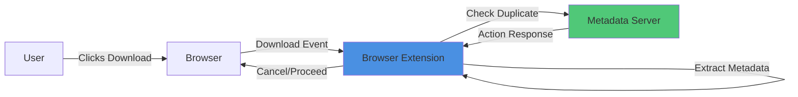
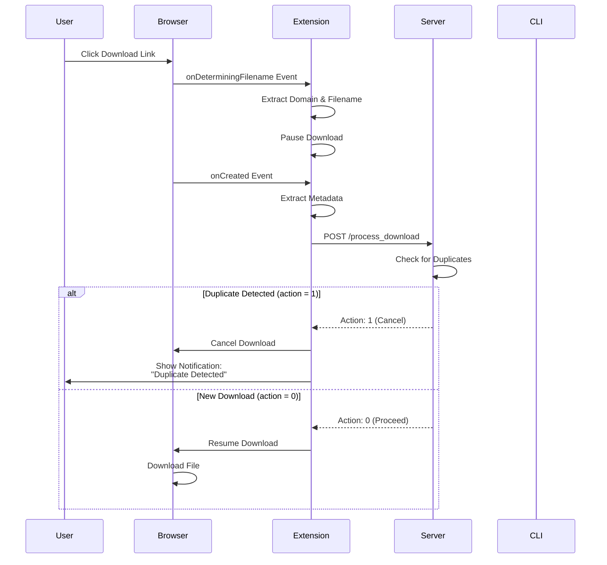

# ReDUCE Browser Extension

> **Chromium-based browser extension for intelligent duplicate download detection**

The ReDUCE Browser Extension monitors download events in real-time, extracts metadata, and communicates with the Metadata Server to prevent redundant downloads before they start.

---

## 📋 Table of Contents

- [Overview](#overview)
- [Features](#features)
- [Prerequisites](#prerequisites)
- [Installation](#installation)
- [How It Works](#how-it-works)
- [Usage](#usage)
- [Project Structure](#project-structure)
- [Configuration](#configuration)
- [Development](#development)
- [Troubleshooting](#troubleshooting)
- [Browser Compatibility](#browser-compatibility)
- [Permissions](#permissions)
- [Known Limitations](#known-limitations)
- [FAQ](#faq)

---

## Overview

### What is the ReDUCE Browser Extension?

The Browser Extension is the **user-facing interface** of the ReDUCE system that:
- **Monitors** all download events in the browser
- **Extracts** comprehensive metadata before downloads begin
- **Communicates** with the Metadata Server for duplicate detection
- **Prevents** redundant downloads automatically
- **Provides** a popup interface to view download history

### Role in ReDUCE System



The extension acts as the **first line of defense** against duplicate downloads.

---

## Features

### ✨ Core Capabilities

- **📥 Download Monitoring**
  - Intercepts all download requests
  - Real-time event processing
  - Automatic metadata extraction

- **🔍 Intelligent Detection**
  - Pre-download duplicate checking
  - Multi-layer server validation
  - Instant cancellation of duplicates

- **📊 Metadata Extraction**
  - URL and domain information
  - File size and MIME type
  - ETag and Last-Modified headers
  - Content-Disposition parsing

- **🖥️ Popup Interface**
  - Active downloads view
  - Download history
  - Statistics dashboard
  - Manual download control

- **🔔 User Notifications**
  - Floating popup alerts
  - Duplicate detection notifications
  - Download status updates

- **⚡ Modern Architecture**
  - Manifest V3 (latest standard)
  - Service Worker background processing
  - Chrome Storage API for persistence

---

## Prerequisites

### System Requirements

- **Browser**: Chromium-based browser (Chrome, Edge, Brave, Vivaldi, Opera)
- **Browser Version**: Chrome 88+ or equivalent
- **ReDUCE Server**: Metadata Server running on `http://127.0.0.1:5050`
- **Developer Mode**: Enabled (for manual installation)

### Supporting Components

Ensure the following ReDUCE components are running:
1. ✅ [Metadata Server](../reduce-Internal-Metadata-Server/) - Running on port 5050
2. ✅ [CLI Utility Tool](../reduce-CLI-Utility-Tool/) - Monitoring file system (optional but recommended)

---

## Installation

### Development Installation

#### Step 1: Prepare Extension Files

Download or clone the `reduce-New-Extension` folder to your local machine.

#### Step 2: Open Extensions Page

**Google Chrome / Microsoft Edge / Brave:**
1. Open browser
2. Navigate to:
   - Chrome: `chrome://extensions/`
   - Edge: `edge://extensions/`
   - Brave: `brave://extensions/`

#### Step 3: Enable Developer Mode

Toggle **Developer mode** switch in the top-right corner.

#### Step 4: Load Unpacked Extension

1. Click **"Load unpacked"** button
2. Navigate to and select the `reduce-New-Extension` folder
3. Click **"Select Folder"**

#### Step 5: Verify Installation

- ✅ Extension appears in extensions list
- ✅ Extension icon visible in toolbar (neon gallery icon)
- ✅ No error messages displayed

### Browser-Specific Instructions

#### Google Chrome

```
1. Open Chrome
2. Go to chrome://extensions/
3. Enable "Developer mode" (top-right)
4. Click "Load unpacked"
5. Select reduce-New-Extension folder
```

#### Microsoft Edge

```
1. Open Edge
2. Go to edge://extensions/
3. Enable "Developer mode" (left sidebar)
4. Click "Load unpacked"
5. Select reduce-New-Extension folder
```

#### Brave Browser

```
1. Open Brave
2. Go to brave://extensions/
3. Enable "Developer mode" (top-right)
4. Click "Load unpacked"
5. Select reduce-New-Extension folder
```

---

## How It Works

### Download Interception Flow



---

### Metadata Extraction

The extension extracts comprehensive metadata from each download:

#### Basic Download Information
- **ID**: Unique download identifier
- **URL**: Original download URL
- **finalUrl**: Final redirect URL
- **filename**: Extracted filename
- **mime**: MIME type
- **totalBytes**: File size in bytes

#### HTTP Headers (via HEAD request)
- **content-length**: File size
- **content-type**: MIME type
- **etag**: Entity tag for caching
- **last-modified**: Last modification date
- **content-disposition**: Filename from server

#### Domain Information
- **domain**: Download server domain
- **downloadFileName**: Extracted filename

#### Hash Verification
- **partial_hash**: SHA-256 hash for verification

---

### Event Handling

#### 1️⃣ `onDeterminingFilename` Event

**Triggered**: When browser determines download filename

**Actions**:
- Extract domain using `extractDomain(url)`
- Capture initial filename
- Store in `downloadDetailsMap`

```javascript
chrome.downloads.onDeterminingFilename.addListener((downloadItem, suggest) => {
  const domain = extractDomain(downloadItem.url);
  const fileName = downloadItem.filename || "Unknown File";
  // Store details...
  suggest(); // Proceed
});
```

---

#### 2️⃣ `onCreated` Event

**Triggered**: When download is created

**Actions**:
1. Add to `activeDownloads`
2. **Pause** download immediately
3. Extract complete metadata
4. Fetch HEAD data from server
5. Compute partial hash
6. Send metadata to backend
7. Handle response (cancel or resume)

```javascript
chrome.downloads.onCreated.addListener(async (downloadItem) => {
  // Pause download
  chrome.downloads.pause(downloadItem.id);
  
  // Extract metadata...
  const backendResponse = await sendMetadataToBackend(...);
  
  if (backendResponse === 1) {
    // Duplicate - show notification
    sendPopupToAllTabs(...);
  } else {
    // New - resume download
    chrome.downloads.resume(downloadItem.id);
  }
});
```

---

#### 3️⃣ `onChanged` Event

**Triggered**: When download state changes

**Actions**:
- Update `activeDownloads` state
- Move completed/interrupted downloads to history
- Persist state to Chrome Storage
- Broadcast updates to popup

---

## Usage

### Basic Usage

#### Automatic Operation

The extension works automatically once installed:

1. **Start a download** - Click any download link
2. **Extension checks** - Metadata sent to server
3. **Server responds** - Duplicate check performed
4. **Action taken**:
   - ✅ New file → Download proceeds
   - ❌ Duplicate → Download cancelled, notification shown

---

### Popup Interface

Click the extension icon to open the Download Manager popup:

#### **Active Downloads Tab**
- View currently downloading files
- See download status (paused, in_progress, complete)
- Cancel downloads manually
- Force resume paused downloads

#### **Download History Tab**
- View completed downloads
- See interrupted/cancelled downloads
- Check download timestamps

---

### Duplicate Detection Notification

When a duplicate is detected:

1. **Floating popup** appears on the current page
2. **Message**: "Duplicate download detected!"
3. **Filename** is displayed
4. **Download is cancelled** automatically
5. **Popup closes** after a few seconds (or click Close button)

---

## Project Structure

```
reduce-New-Extension/
│
├── manifest.json                  # Extension configuration (Manifest V3)
│
├── background/                    # Service Worker (background processing)
│   ├── index.js                  # Service worker entry point
│   └── observer.js               # Download event handler (main logic)
│
├── content/                       # Content Scripts
│   └── popup.js                  # Floating notification popup (injected)
│
├── pages/                         # Extension UI Pages
│   ├── popup.html                # Manager popup UI
│   └── popup.js                  # Manager popup logic
│
├── utils/                         # Utility Modules
│   ├── downloadUtils.js          # Helper functions (hash, domain extraction)
│   └── api.js                    # Server communication
│
└── icons/                         # Extension Icons
    └── neon-gallery.png          # Extension icon (16x16, 48x48, 128x128)
```

---

### Key Files Explained

#### `manifest.json`
Extension configuration file (Manifest V3):
- Defines permissions (`downloads`, `storage`, `scripting`)
- Specifies service worker (`background/index.js`)
- Configures popup UI (`pages/popup.html`)
- Sets host permissions (`<all_urls>`)

#### `background/observer.js`
**Core logic** - download event handling:
- Listens to `onDeterminingFilename`, `onCreated`, `onChanged`
- Extracts metadata and sends to server
- Handles server responses (cancel/resume)
- Manages active downloads and history
- Broadcasts updates to popup

#### `utils/downloadUtils.js`
Helper functions:
- `extractDomain(url)` - Extract domain from URL
- `computePartialHash(url, bytes)` - Generate verification hash
- `fetchHeadData(url)` - Fetch HTTP HEAD metadata

#### `utils/api.js`
Server communication:
- `sendMetadataToBackend(...)` - POST to `/process_download`
- `getDeviceInfo()` - Collect device information
- Error handling and retries

#### `pages/popup.html` + `popup.js`
Manager popup interface:
- Display active downloads
- Show download history
- Provide manual controls (cancel, resume)

---

## Configuration

### Server Endpoint

**File**: `utils/api.js`

```javascript
const SERVER_URL = "http://127.0.0.1:5050";
```

**To change**:
1. Open `utils/api.js`
2. Modify `SERVER_URL` constant
3. Reload extension in `chrome://extensions/`

---

### Download Monitoring Behavior

**File**: `background/observer.js`

Customize notification behavior (Line 252-257):
```javascript
if (backendResponse === 1) {
  sendPopupToAllTabs(
    downloadItem.id,
    "Duplicate download detected!",  // Change message here
    downloadFileNameDomainUrlDetails.downloadFileName
  );
}
```

---

## Development

### Setting Up Development Environment

#### No Build Required

The extension runs directly from source - no compilation needed!

#### Development Workflow

1. **Make code changes** in `reduce-New-Extension/`
2. **Reload extension**:
   - Open `chrome://extensions/`
   - Find ReDUCE extension
   - Click **🔄 Reload** button
3. **Test changes** by initiating downloads

---

### Testing

#### Manual Testing Checklist

- [ ] Extension loads without errors
- [ ] Icon appears in toolbar
- [ ] Popup opens when clicked
- [ ] Downloads are intercepted
- [ ] Metadata is extracted
- [ ] Server communication works
- [ ] Duplicates are detected
- [ ] Notifications appear
- [ ] New downloads proceed normally

#### Test Scenario 1: New Download

1. Find a file to download (e.g., test PDF)
2. Click download link
3. Verify download proceeds normally
4. Check popup shows download in Active tab

#### Test Scenario 2: Duplicate Download

1. Download a file (from Scenario 1)
2. Download **the same file again**
3. Verify:
   - Download is cancelled
   - Notification appears saying "Duplicate detected!"
   - Popup shows download was cancelled

---

### Debugging

#### View Console Logs

**Service Worker Console:**
1. Open `chrome://extensions/`
2. Find ReDUCE extension
3. Click **"service worker"** link under extension details
4. View console output

**Expected logs:**
```
[Observer] New download detected: {...}
[Observer] Download paused: 123
[Observer] Backend response received: 0
[Observer] Normal download. Resuming...
```

#### Common Debug Messages

```javascript
console.log("[Observer] Captured downloadFileNameDomainUrlDetails:", ...);
console.log("[Observer] Backend response received:", ...);
console.log("[Observer] Duplicate detected. Showing popup...");
console.log("[Observer] Normal download. Resuming...");
```

---

### Modifying Extension

#### Example: Change Notification Duration

**File**: `content/popup.js`

```javascript
// Auto-close popup after 5 seconds (change duration here)
setTimeout(() => {
  popup.remove();
}, 5000); // Change to 10000 for 10 seconds
```

#### Example: Add Custom Metadata Field

**File**: `background/observer.js`

```javascript
const downloadMetaData = {
  // ... existing fields
  customField: "custom value", // Add here
};
```

Then update server to accept new field.

---

## Troubleshooting

### Common Issues

#### ❌ Extension Not Loading

**Symptom**: Extension not visible in `chrome://extensions/`

**Solutions**:
1. Ensure Developer mode is enabled
2. Reload extension folder (may have moved)
3. Check for manifest.json errors in console
4. Verify manifest version is 3

---

#### ❌ Downloads Not Being Intercepted

**Symptom**: Downloads proceed without duplicate check

**Solutions**:
1. **Check permissions**: Verify `downloads` permission in manifest
2. **Reload extension**: Click reload in `chrome://extensions/`
3. **Check service worker**: Ensure it's running (click "service worker" link)
4. **Verify server**: Ensure Metadata Server is running on port 5050
5. **Check console**: Look for JavaScript errors

---

#### ❌ Server Connection Failed

**Symptom**: "Failed to fetch" or server not responding

**Solutions**:
1. **Start Metadata Server**:
   ```bash
   cd reduce-Internal-Metadata-Server
   python main.py
   ```
2. **Verify port**: Server should be on `http://127.0.0.1:5050`
3. **Check CORS**: Ensure server allows requests from extension
4. **Firewall**: Check if port 5050 is blocked

---

#### ❌ Popup Not Opening

**Symptom**: Clicking extension icon does nothing

**Solutions**:
1. Check `manifest.json` has correct popup path:
   ```json
   "action": {
     "default_popup": "pages/popup.html"
   }
   ```
2. Verify `popup.html` exists in `pages/` folder
3. Check browser console for errors
4. Reload extension

---

#### ❌ Notifications Not Showing

**Symptom**: Duplicate detected but no notification

**Solutions**:
1. Check if content script injected successfully
2. Verify `content/popup.js` exists
3. Check `scripting` permission in manifest
4. Look for injection errors in service worker console

---

#### ❌ Downloads Always Cancelled

**Symptom**: All downloads are cancelled, even new ones

**Solutions**:
1. **Check server response**: Should be `action: 0` for new downloads
2. **Verify server logic**: Check duplicate detection algorithm
3. **Clear database**:
   ```bash
   cd reduce-Internal-Metadata-Server
   rm downloads.db
   python main.py  # Recreates database
   ```
4. **Check console**: `backendResponse === 1` should only occur for actual duplicates

---

## Browser Compatibility

### Supported Browsers ✅

| Browser | Version | Status | Notes |
|---------|---------|--------|-------|
| **Google Chrome** | 88+ | ✅ Fully Supported | Primary development target |
| **Microsoft Edge** | 88+ | ✅ Fully Supported | Chromium-based |
| **Brave** | Latest | ✅ Fully Supported | Chromium-based |
| **Vivaldi** | Latest | ✅ Fully Supported | Chromium-based |
| **Opera** | Latest | ✅ Fully Supported | Chromium-based (post-2013) |

### Not Supported ❌

| Browser | Reason |
|---------|--------|
| **Firefox** | Uses WebExtensions API (different from Chrome) |
| **Safari** | Uses Safari Extensions (different API) |
| **Internet Explorer** | No extension support |
| **Old Opera** | Pre-2013 versions (Presto engine) |

---

## Permissions

### Required Permissions

The extension requests the following permissions in `manifest.json`:

#### `downloads`
**Purpose**: Monitor and control downloads
- Listen to download events
- Cancel duplicate downloads
- Resume paused downloads

#### `storage`
**Purpose**: Persist download data
- Store active downloads across browser restarts
- Maintain download history
- Cache configuration

#### `scripting`
**Purpose**: Inject content scripts
- Display floating notifications
- Inject `content/popup.js` into pages

#### `host_permissions: ["<all_urls>"]`
**Purpose**: Monitor downloads from any website
- Required to intercept downloads from all domains
- Enables comprehensive duplicate detection

---

### Privacy & Security

- ✅ **No external data transmission** - All data stays on your device
- ✅ **Local server only** - Communicates with `127.0.0.1:5050`
- ✅ **No tracking or analytics** - No user data collected
- ✅ **Transparent operation** - All code is visible and auditable

---

## Known Limitations

### Current Limitations

1. **Requires Local Server**
   - Metadata Server must run on `localhost:5050`
   - Cannot function standalone

2. **HTTP/HTTPS Only**
   - Only monitors HTTP(S) downloads
   - FTP, file:// URIs not supported

3. **Manual Installation**
   - Not published on Chrome Web Store
   - Requires developer mode

4. **Chromium-Only**
   - Does not work with Firefox/Safari
   - Manifest V3 is Chrome-specific

5. **Service Worker Lifespan**
   - Service worker may stop after idle period
   - Browser restarts worker automatically

---

## FAQ

### Frequently Asked Questions

#### ❓ Why was my download cancelled?

The server detected an identical file already exists on your system. Check the download history in the popup to see previous downloads.

---

#### ❓ Can I force download a detected duplicate?

Currently, automatic cancellation cannot be bypassed. Future versions may include a "Download Anyway" option.

---

#### ❓ How do I view download history?

1. Click the extension icon
2. Switch to the "History" tab in the popup
3. View all completed/cancelled downloads

---

#### ❓ Does this work with Firefox?

No. Firefox uses a different extension API (WebExtensions). A Firefox version would require a complete rewrite.

---

#### ❓ Can I whitelist certain websites?

This feature is not currently implemented. Consider opening a feature request on GitHub.

---

#### ❓ Will this extension slow down my browser?

No. The extension only activates during download events, which is minimal overhead. Service workers are efficient and only run when needed.

---

#### ❓ Is my download data sent to the cloud?

No. All communication is with your **local server** (`127.0.0.1:5050`). No external servers are contacted.

---

#### ❓ Can I use this on multiple devices?

Yes, but each device needs:
- The extension installed
- Metadata Server running
- Separate download databases (device-specific tracking)

---

## Advanced Usage

### Customizing Duplicate Behavior

**File**: `background/observer.js`

Add custom logic before server check:

```javascript
// Example: Allow duplicates from specific domain
if (domain === "trusted-site.com") {
  chrome.downloads.resume(downloadItem.id);
  return; // Skip server check
}
```

---

### Building for Distribution

#### Create ZIP for Distribution

```bash
# Navigate to parent directory
cd ..

# Create zip (exclude unnecessary files)
zip -r reduce-extension.zip reduce-New-Extension/ \
  -x "*.git*" "*.DS_Store" "*node_modules/*"
```

#### Prepare for Chrome Web Store (Optional)

1. **Update manifest.json**:
   - Increment version
   - Add description
   - Add icons (128x128 required)

2. **Create promotional images**:
   - Small tile: 440x280
   - Large tile: 920x680
   - Marquee: 1400x560
   - Screenshots: 1280x800 or 640x400

3. **Submit to Chrome Web Store**:
   - Create developer account ($5 fee)
   - Upload ZIP file
   - Fill out store listing
   - Submit for review

---

## Related Documentation

- **[Root README](../README.md)** - Complete ReDUCE system overview
- **[Metadata Server README](../reduce-Internal-Metadata-Server/README.md)** - API documentation
- **[CLI Utility Tool README](../reduce-CLI-Utility-Tool/README.md)** - File monitoring

---

## Support

For issues, questions, or contributions:
- 📧 Open an issue on GitHub
- 📖 Check the [Troubleshooting](#troubleshooting) section
- 🔍 Review the [FAQ](#faq)

---

<div align="center">

**Built for seamless duplicate prevention**

*Part of the ReDUCE ecosystem*

</div>
